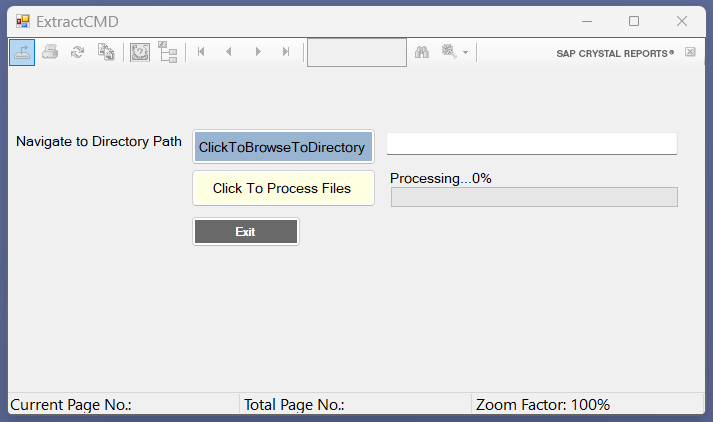
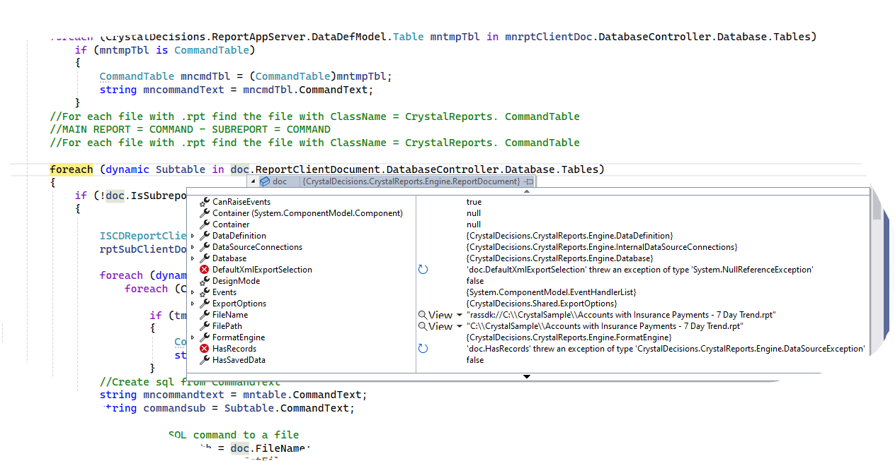

# Extract-COMMAND-from-Crystal-Report-SnowFlake

## 📘 Project: Extract COMMAND from Crystal Report to Snowflake

### 🧩 Purpose

This project automates the extraction and migration of SQL **Command** queries embedded within Crystal Report (`.rpt`) files into a Snowflake-compatible format. It supports modernization of legacy BI/reporting environments by capturing raw SQL logic that can be used to:

- Create **Snowflake Views**, **Stored Procedures**, or **SQL Packages**
- Serve as data sources for **Power BI**, **Tableau**, or other analytics platforms
- Analyze and validate changes to **data structure** during Electronic Medical Record (EMR) upgrades

---

### 🚨 Problem Statement

- **Crystal Reports with embedded Commands** (custom SQL SELECT statements) are often scattered across `.rpt` files.
- Crystal’s own interface makes it difficult to easily extract and reuse this SQL in other systems.
- Organizations migrating to Snowflake lack a systematic way to capture and migrate these embedded queries efficiently.

---

### 🛠️ Approach

1. **Parse `.rpt` files programmatically**, using the Crystal Reports .NET SDK (or InterOp/RAS) to locate Command tables.
2. **Extract the `CommandText`** from `CommandTable` objects (or `ReportClientDocument.DatabaseController.Database.Tables`), via code in .NET (C#).
3. **Optionally use `RowsetController.GetSQLStatement`** for cases where `CommandText` is incomplete.
4. **Transform and adapt SQL syntax** so it’s compatible with Snowflake SQL dialect (e.g. convert joins, limit syntax, identifiers, etc.).
5. **Output results** in a structured format (plain‑text, JSON, or SQL files) for easy review and SQL re‑use.

---

### 🔎 Insights & Results

- Successfully extracts full SQL text from embedded Crystal Commands in most `.rpt` files—even those using parameterized or complex custom SQL.
- `CommandText` retrieval worked for primary reports; for deeper or more complicated statements, falling back to `GetSQLStatement()` improved coverage.
- SQL translation into Snowflake-compatible dialect is straightforward for most ANSI‑standard SELECTs; edge‑cases (e.g. vendor‑specific functions) require manual adjustment.
- Overall, this workflow enables rapid migration of legacy report-based SQL logic into Snowflake, reducing manual effort and risk.

---

### 🧭 How to Use

```text
dotnet run -- input-folder="path/to/.rpt/files" --output-folder="path/to/sql-output" [--format=json|text]
```

- Scans `.rpt` files in the input folder.
- Writes one `.sql` or `.json` per report, containing the extracted Command.
- Optional flags:

  - `--translate-snowflake` to auto-apply SQL syntax changes.
  - `--report-params` to document parameter placeholders.

---

### 🧱 Project Structure

```text
/Extract‑COMMAND‑from‑Crystal‑Report‑SnowFlake
├── src/                # code for parsing, extracting, translating
├── input/              # sample .rpt files (for testing)
├── output/             # extracted SQL / results
└── README.md           # this documentation
```

---

### ✅ Benefits

- **Automates migration**: reduces manual retrieval/retyping of embedded SQL logic.
- **Audit-friendly**: captures original SQL for documentation, version control, and review.
- **Flexible output**: easily integrates into deployment scripts or further ETL transformation flows.

---

### 🔮 Future Work

- Add UI to review and approve extracted queries manually.
- Support extraction from **sub‑reports** (currently requires separate loading per embedded rpt).
- Enhance SQL translator to cover more vendor-specific syntax and functions.
- Provide a packaged installer or CLI tool for easier distribution across teams.

---

### 📎 References

- Techniques using Crystal .NET SDK to extract `CommandText` and `GetSQLStatement()` functionality.

---

## The Repository

This repository is a C# project created to extract the COMMAND SQL Object from a SAP Crystal Report. The SQL is extracted and saved to a Snowflake Table which can then be queried for table and column names which have been deprecated or changed due to software upgrades.

## Screenshots





## Technologies

The code is written with:

- C#
- Visual Studio with SAP Crystal Reports, developer version for Microsoft Visual Studio
- app.snowflake.com
- Crystal .NET SDK to extract CommandText and GetSQLStatement() functionality.
